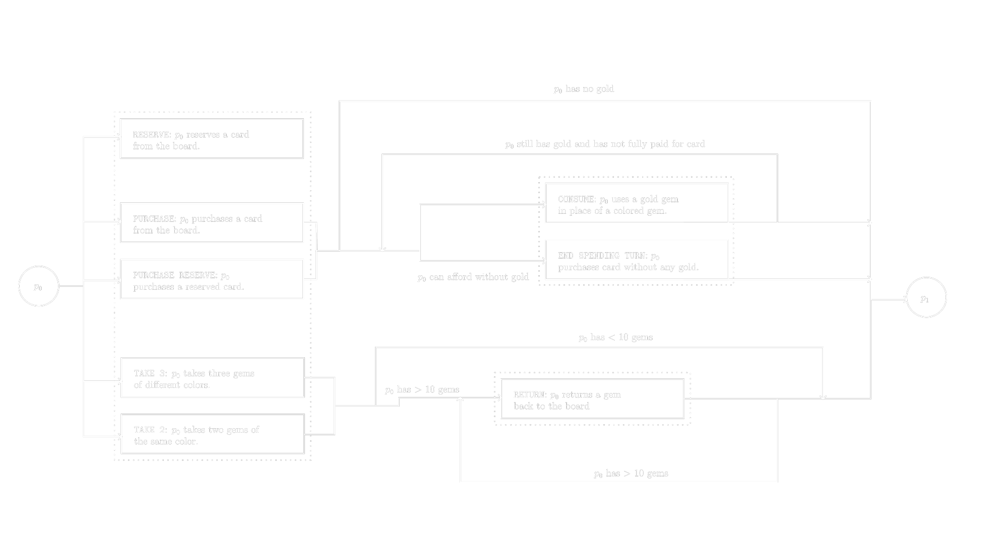
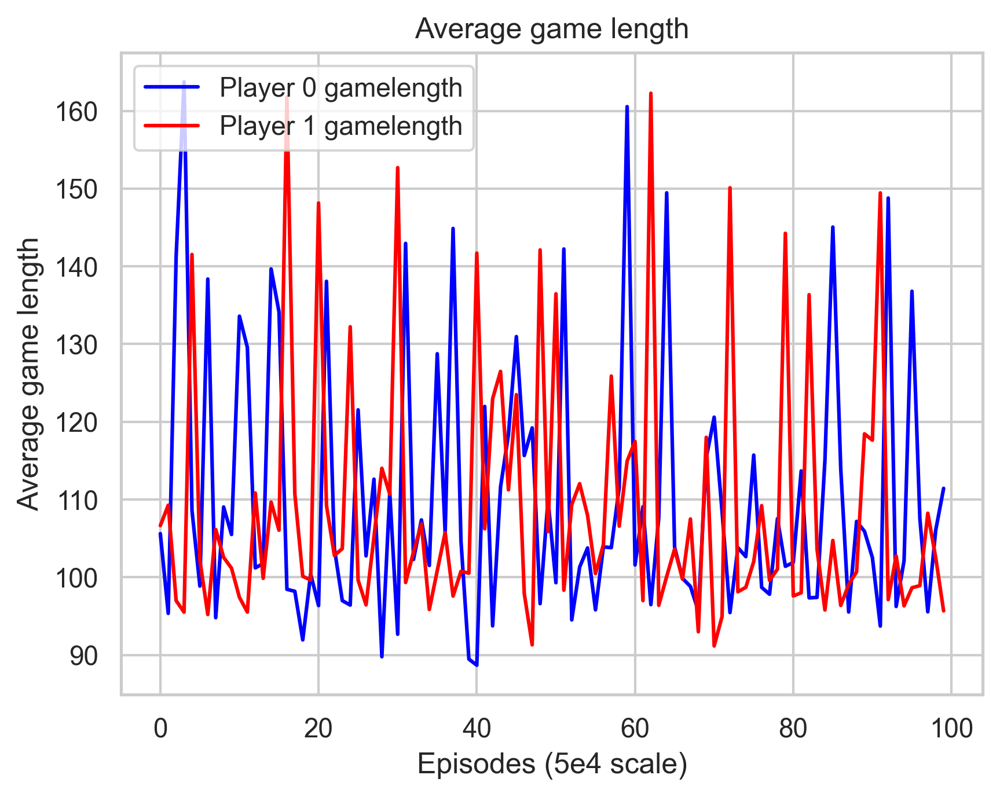
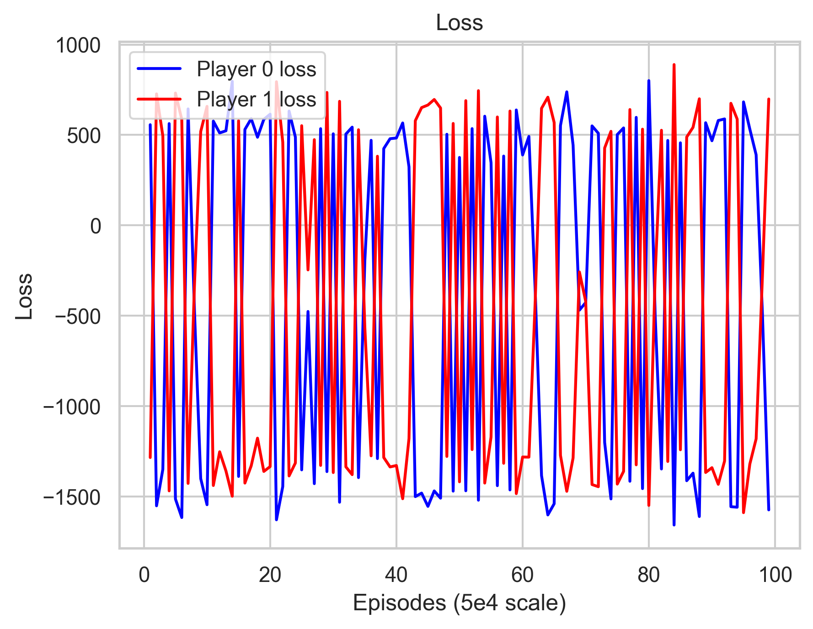
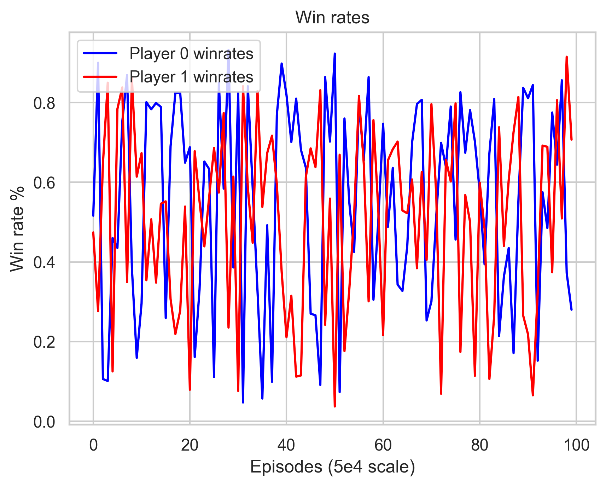

## Project Summary
Our primary goal is to create an reinforcement learning (RL) trained agent that can play the Splendor board game. Thus far, we have coded the Splendor board game within the OpenSpiel framework. In doing so, we have immediate access to reinforcement learning algorithms including DQN and PPO. As of week 7, we have written extensive tests for the Splendor game and to our knowledge the game is in a working state. We have also run OpenSpiel's Q-learning algorithm against the game with 500,000 episodes, leading to poor results. Our goal for the rest of the quarter is to fine tune the reward shaping and try PPO and DQN. 

## Approach

### Summary
We built Splendor from scratch within the OpenSpiel environment. Crucially, we had to decide on an observation system, action system, and rewards system.
After implementing the game and these systems, we tested them against OpenSpiel's Q-learning algorithm.

### Action System
Defining an action system for Splendor was our first major hurdle. Although the action space is discrete we had to partition the action space into different "turn types"
to limit an exponential growth of discrete actions. 

As illustrated in the diagram with the dotted rectangular regions, we partitioned the action space into three "turn types". The `SPENDING` turn type (top right) enables
a player to use gold to purchase a card without needing an action for every variation. This reduces $5^5 \times 12$ actions to $12$ actions. Similarly, the `RETURN` turn type (bottom left)
allows a player to take two or three gems and return gems from their inventory if they exceed 10 gems without needing an action for every variation. This reduces $5^2 \times \big( \binom{5}{2} + \binom{5}{3} \big)$
actions to $\binom{5}{2} + \binom{5}{3}$ actions. 

### Observation System
Building the observation system for Splendor was the next key problem that we solved. 
OpenSpiel requires a one dimensional tensor to be returned from the `set_from` function of the `BoardObserver` class. This tensor
represents an observation of the game state that is fed as input to the RL algorithms in OpenSpiel. Note that Splendor is an imperfect information game,
since there are three "upside-down" decks that both the board and the player draw from. Note also that both players observe identical information at all times, 
simplifying the creation of the observation tensor.

First, we define a card vector, $\vec{C} = (p, \vec{t}, \vec{g})$. $p$ is the number of points associated with a card. $\vec{t}$ is a five element 
vector representing the one-hot encoding of the card type (e.g. $(1, 0, 0, 0, 0)$ corresponds to a white card). $\vec{g}$ is a five
element vector corresponding to the costs of each gem type for the card.

Second, we define a player vector for the $i\text{'th}$ player, $p_i =  (s_i, \vec{g_i}, \vec{C_{i_0}}, \vec{C_{i_1}}, \vec{C_{i_2}})$. $s_i$ is the score/points for the $i\text{'th}$ player.
$g_i$ is the gem array of the $i\text{'th}$ player, containing six entries corresponding to the gem count (including gold) of each player. $\vec{C_{i_j}}$ is the 
$j\text{'th}$ reserved card of the $i\text{'th}$ player; this vector is filled with zeroes if the player has no reserved card at that slot. 

Third, we define a board vector $\vec{B} = (\vec{g}, \vec{C_{00}}, \vec{C_{01}}, \vec{C_{02}}, \vec{C_{03}}, \vec{C_{10}}, \vec{C_{11}}, \vec{C_{12}}, \vec{C_{13}}, \vec{C_{20}}, \vec{C_{21}}, \vec{C_{22}}, \vec{C_{23}} )$. $\vec{g}$ is a six element vector representing the gems (including gold) on the board. Card vectors 
$\vec{C_{00}} \dots \vec{C_{23}}$ represent the cards on the board that the players can purchase or reserve. 

These vectors are generated on the fly using information in the data structures of the game. Specifically, these vectors are used to form the entire observation vector of the game state,

$$\text{observation} = (\vec{p_0}, \vec{p_1}, \vec{B}, \vec{C_s})$$

, where $\vec{C_s}$ is what we call the "spending card". This card appears during a `SPENDING` turn type when the
player can choose to redeem gold for a specific colored gem of the card. For example, if a player spends a 
gold gem in place of a blue gem, this is reflected in the blue cost of $\vec{C_s}$. 

### Rewards System
We also built a reward mechanism for the Splendor game. OpenSpiel requires a `returns` function which returns a two element vector representing the total accumulated rewards
for player 0 and player 1. Note that the two person variation of Splendor is a zero sum game, so we can calculate the rewards of player 1 as 
the opposite of player 0's rewards. 

First, we define $w_i$ to be 0 if player $i$ has not won, otherwise 1. Second, we define $s_i$ to be the total points of player $i$. Third,
we define $r_i$ to be the total amount of resources of player $i$. We use these values to calculate the accumulated reward of player 0 with the function, 

$$\text{player 0 returns} = \alpha(w_0 - w_1) + \beta(s_0 - s_1) + \gamma(r_0 - r_1)$$

, with $\alpha = 1000$, $\beta = 3$, and $\gamma = 1.5$. We plan to experiment with the values of $\alpha, \beta, \gamma$. Time permitted, we also want to make $\gamma$ and $\beta$
functions of the number of time steps in the game. Specifically, we want to try increasing $\beta$ and lowering $\gamma$ as the time steps increases. Our hope is that this matches
to the strategy in Splendor of focusing on resource acquisition in the early game, then trying to get points with the resources you've aquired in the later stages of the game. 

### Algorithm
While we plan to use other algorithms, we have currently experimented with OpenSpiel's implementation of the Q-Learning algorithm. Q-Learning is a model-free algorithm which uses a structure known as the Q-Table that gets updated for every action and the reward of that action it its given state. After the Q-Table gets filled from steps in separate states, decisions are then made based on the maximum expected reward of an action in a given state.

([Source](https://en.wikipedia.org/wiki/Q-learning))

By creating the Splendor game in accordance with OpenSpiel's framework, we easily tapped into the Q-Learning algorithm. We utilized a discount factor of 1.0 and a learning rate/step size of 0.1 for our preliminary testing ([Source]((Q-Learning)[https://github.com/google-deepmind/open_spiel/blob/master/open_spiel/python/algorithms/tabular_qlearner.py].)). Every episode trained agents for player 0 and 1 play against random agents and every 1000 episodes the they then evaluated against random agents to obtain their win rates.

## Evaluation
### Game Testing
Thus far, most of our testing efforts have been directed towards the Splendor game itself. We utilized Python's `unittest` framework 
to build tests for the game, which are summarized below:
* `array_test.py` - tests the observation tensor
* `board_test.py` - tests methods of the `Board` object
* `player_test.py` - tests methods of the `Player` object
* `splendor_game_test.py` - higher level testing that simulates game timesteps (e.g. tests that a player rewards when receiving resources)

We also tested the game manually by playing against each other. We overloaded the `__str__` of the game state object 
to generate a human readable ASCII illustration of the game state. As we played, we verified
visually using this string output that the game state was correct. 

### Q-Learning Results
The results from our Q-Learning test were unsatisfactory. We trained two agents engaging in self-play over 500,000 episodes; every 5000 episodes
we captured the loss of each agent, the average game length of the agents against a random player over 1000 games, and the average win percentage
of each agent against a random player over 1000 games. 

    
    
    

As shown in the plots above, all statistics ossilate heavily, even after 500,000 episodes. Although it was a small success that Splendor could run
for 500,000 episodes without a crash, the results are dissapointing nonetheless We will pivot immediately to DQN and PPO for the remainder of the quarter. However, this preliminary testing
did provide insight in other statistics that we can measure going forward, namely: 
* the average rewards,
* the average number of times that both players have no moves (results in immediate game termination with no clear winner),
* and the average number of time the first priority deck runs out of cards (results in immediate game termination with no clear winner).

### Qualitative Analysis
* experiment with humans playing against trained agent (qualitative result)
TODO

## Remaining Goals and Challenges
### Other Algorithms
As our current training results have shown, Q-learning is likely not sufficient for creating a strong agent to play Splendor. In 500,000 episodes there has been no real improvement in the agent's performance against random players. While the agent could be trained for more time, it will most likely have no noticeable performance improvement. Moving forward, we intend to try other algorithms such as Deep Q-learning and PPO. Once we have trained multiple algorithms for long enough to see noticeable improvement, we can pick the most promising algorithm and train them for an extended period of time.

### Tuning Hyperparameters
Another improvement we can make is fine-tuning hyperparameters in a way that will encourage the agent to take actions that give them an advantage in the game. Currently, we reward the agent points on the following scale:
* 10 for every point acquired.
* 1.5 for every permanent resource acquired.
* 1000 for winning the game.
One change we can make is changing the scale of these points and training agents on different scaling of these rewards to find a better scaling. We can also introduce other parameters, such as gems acquired and gold acquired. Furthermore, we can reward the agent for accumulating gems and resources of the same type and for collecting gems that are more useful for purchasing current reserved cards and cards on the board.

### Training time

* Limitation of current p
* challenge: inconsistencies in win rates
* Implement and test other algorithms
* make comparisons to other algorithms
* run for longer on hpc3
* test changing rewards shaping and hyperparameters

## Resources
- [OpenSpiel](https://github.com/google-deepmind/open_spiel): We prototyped the Splendor game by modifying the `open_spiel/python/games/kuhn_poker.py` file. We also used
and modified the `open_spiel/python/examples/tic_tac_toe_qlearner.py` to run Q-learning against our game.

- [Splendor Rules](https://cdn.1j1ju.com/medias/7f/91/ba-splendor-rulebook.pdf): We used the official rules to inform our action system for the Splendor game. 
- [Splendor Card Info Spreadsheet](https://docs.google.com/spreadsheets/d/15ghp8rJ_vdVgxZIVJGawAYQXRMZSVHJYpZRfQUplAhE/edit?usp=sharing): We used this spreadsheet to
initialize the metadata of the card decks when the Splendor game starts. 
- [ChatGPT](https://chatgpt.com/): We used ChatGPT for minor debugging purposes and various one-liners relating to libraries
we used such as Numpy and PyPlot. We did not use AI tools to generate a significant blocks of code for our project. 
- [Python Documentation](https://docs.python.org/3/)
